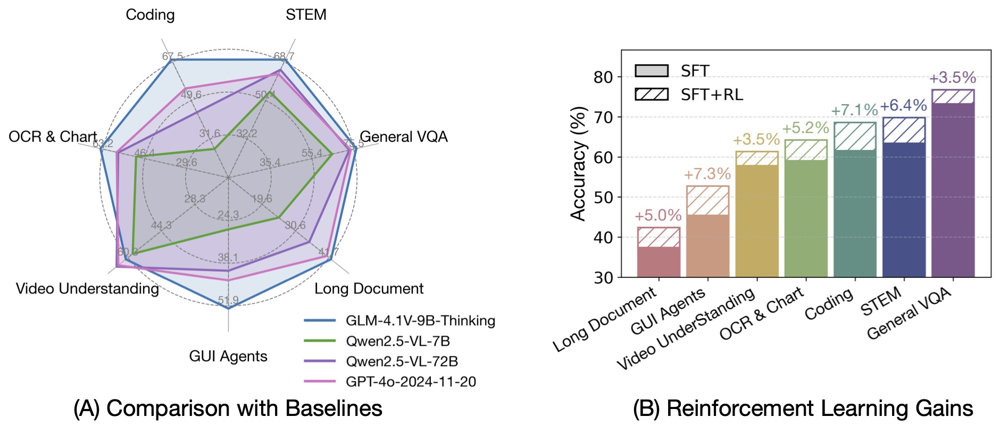

# GLM-4.1V-Thinking

[Read this in English.](./README.md)

<div align="center">

</div>
<p align="center">
    👋 加入我们的 <a href="resources/WECHAT.md" target="_blank">微信</a> 和 <a href="https://discord.com/invite/8cnQKdAprg" target="_blank">Discord</a> 社区。
    <br>
    📖 查看 GLM-4.1V-9B-Thinking <a href="https://arxiv.org/abs/2507.01006" target="_blank">论文</a> 。
    <br>
    💡 立即在线体验 <a href="https://huggingface.co/spaces/THUDM/GLM-4.1V-9B-Thinking-API-Demo" target="_blank">Hugging Face</a> 或 <a href="https://modelscope.cn/studios/ZhipuAI/GLM-4.1V-9B-Thinking-Demo" target="_blank">ModelScope</a> 上的 GLM-4.1V-9B-Thinking。
    <br>
    📍 在 <a href="https://www.bigmodel.cn/dev/api/visual-reasoning-model/GLM-4.1V-Thinking">智谱大模型开放平台</a> 使用 GLM-4.1V-9B-Thinking 的API服务。
</p>

## 项目更新

- 🔥 **News**: `2025/07/16`: 我们已经开源了训练 GLM-4.1V-Thinking 时使用的 **VLM 奖励系统**！查看[代码仓库](https://github.com/THUDM/GLM-4.1V-Thinking/tree/main/glmv_reward)并在本地运行：`python examples/reward_system_demo.py`

- **News**: `2025/07/02`: [GLM-4.1V-9B-Thinking 系列](https://huggingface.co/THUDM/GLM-4.1V-9B-Thinking)现已开源！支持增强的视觉推理和智能体交互。

- **News**: `2025/07/01`: 我们发布了 GLM-4.1V-Thinking 的[技术报告](https://arxiv.org/abs/2507.01006)。

## 模型介绍

视觉语言大模型（VLM）已经成为智能系统的关键基石。随着真实世界的智能任务越来越复杂，VLM模型也亟需在基本的多模态感知之外，
逐渐增强复杂任务中的推理能力，提升自身的准确性、全面性和智能化程度，使得复杂问题解决、长上下文理解、多模态智能体等智能任务成为可能。

基于 [GLM-4-9B-0414](https://github.com/THUDM/GLM-4) 基座模型，我们推出新版VLM开源模型 **GLM-4.1V-9B-Thinking**
，引入思考范式，通过课程采样强化学习 RLCS（Reinforcement Learning with Curriculum Sampling）全面提升模型能力，
达到 10B 参数级别的视觉语言模型的最强性能，在18个榜单任务中持平甚至超过8倍参数量的 Qwen-2.5-VL-72B。
我们同步开源基座模型 **GLM-4.1V-9B-Base**，希望能够帮助更多研究者探索视觉语言模型的能力边界。



与上一代的 CogVLM2 及 GLM-4V 系列模型相比，**GLM-4.1V-Thinking** 有如下改进：

1. 系列中首个推理模型，不仅仅停留在数学领域，在多个子领域均达到世界前列的水平。
2. 支持 **64k** 上下长度。
3. 支持**任意长宽比**和高达 **4k** 的图像分辨率。
4. 提供支持**中英文双语**的开源模型版本。

## 模型信息

### 模型下载地址

| 模型                   | 下载地址                                                                                                                                               | 模型类型 |
|----------------------|----------------------------------------------------------------------------------------------------------------------------------------------------|------|
| GLM-4.1V-9B-Thinking | [🤗Hugging Face](https://huggingface.co/THUDM/GLM-4.1V-9B-Thinking)<br> [🤖 ModelScope](https://modelscope.cn/models/ZhipuAI/GLM-4.1V-9B-Thinking) | 推理模型 |
| GLM-4.1V-9B-Base     | [🤗Hugging Face](https://huggingface.co/THUDM/GLM-4.1V-9B-Base)<br> [🤖 ModelScope](https://modelscope.cn/models/ZhipuAI/GLM-4.1V-9B-Base)         | 基座模型 |

模型算法代码可以查看 [transformers](https://github.com/huggingface/transformers/tree/main/src/transformers/models/glm4v)
的完整实现。

### 运行要求

#### 推理

| 设备（单卡）      | 框架           | 最低显存占用 | 速度                 | 精度   |
|-------------|--------------|--------|--------------------|------|
| NVIDIA A100 | transformers | 22GB   | 14 - 22 Tokens / s | BF16 |
| NVIDIA A100 | vLLM         | 22GB   | 60 - 70 Tokens / s | BF16 |

#### 微调

该部分数据使用 [LLaMA-Factory](https://github.com/hiyouga/LLaMA-Factory) 提供的图片微调方案进行测试。

| 设备(集群)      | 策略         | 最低显存占用 / 需要卡数 | 批大小 (per GPUs) | 冻结情况   |
|-------------|------------|---------------|----------------|--------|
| NVIDIA A100 | LORA       | 21GB / 1卡     | 1              | 冻结 VIT |
| NVIDIA A100 | FULL ZERO2 | 280GB / 4卡    | 1              | 冻结 VIT |
| NVIDIA A100 | FULL ZERO3 | 192GB  / 4卡   | 1              | 冻结 VIT |
| NVIDIA A100 | FULL ZERO2 | 304GB  / 4卡   | 1              | 不冻结    |
| NVIDIA A100 | FULL ZERO3 | 210GB  / 4卡   | 1              | 不冻结    |

> 使用 Zero2 微调可能出现 Loss 为 0 的情况，建议使用 Zero3 进行微调。

## 榜单信息

GLM-4.1V-9B-Thinking 通过引入「思维链」（Chain-of-Thought）推理机制，在回答准确性、内容丰富度与可解释性方面，
全面超越传统的非推理式视觉模型。在28项评测任务中有23项达到10B级别模型最佳，甚至有18项任务超过8倍参数量的Qwen-2.5-VL-72B。


## 模型推理

模型推理代码均在 `inference` 文件夹中，包含了:

- `trans_infer_cli.py`: 使用`transformers`库作为推理后端的命令行交互脚本。你可以使用它进行连续对话。
- `trans_infer_gradio.py`: 使用`transformers`库作为推理后段的 Gradio 界面脚本，搭建一个可以直接使用的 Web
  界面，支持图片，视频，PDF，PPT等多模态输入。
- 使用`vllm`直接拉起`OpenAI`格式的API服务。并在`vllm_api_request.py`中提供了一个简单的请求示例。

    ```shell
  vllm serve THUDM/GLM-4.1V-9B-Thinking --limit-mm-per-prompt '{"image":32}'   --allowed-local-media-path /
    ```

  - `limit-mm-per-prompt`若不指定，只支持1张图片。模型支持最多1个视频或300张图片输入，不支持图片和视频同时输入。
  - `allowed-local-media-path` 需要指定允许访问多模态图片的路径。

- `trans_infer_bench`：用于学术复现的推理脚本，支持`GLM-4.1V-9B-Thinking`模型。其核心在于
  - 指定了中断思考的长度，当思考长度超过`8192`时，强制中断思考并补上`</think><answer>`
    再次发起请求，让模型直接输出答案。该例子中使用的一个视频作为输入的测试的例子。其他情况需自行修改。
  - 该方案仅提供 `transformers` 版本，vLLM版本需要自行根据该逻辑修改方案。

- `vllm_request_gui_agent.py`: 该脚本展现了用于 GUI Agent时对于模型返回的处理和构建提示词方案,
  包含手机，电脑和网页端的策略，可集成到您的应用框架。GUI Agent详细文档请查看[这里](resources/agent_zh.md)

- 使用 Ascend NPU 设备推理，可查看 [这里](https://gitee.com/ascend/MindSpeed-MM/tree/master/examples/glm4.1v/README.md)

## 模型微调

[LLaMA-Factory](https://github.com/hiyouga/LLaMA-Factory) 已经支持本模型的微调。以下是构建数据集的说明，这是一个使用了两张图片的数据集。你需要将数据集整理为
`finetune.json`

```json
[
  {
    "messages": [
      {
        "content": "<image>Who are they?",
        "role": "user"
      },
      {
        "content": "<think>\nUser ask me to observe the image and get the answer. I Know they are Kane and Gretzka from Bayern Munich.</think>\n<answer>They're Kane and Gretzka from Bayern Munich.</answer>",
        "role": "assistant"
      },
      {
        "content": "<image>What are they doing?",
        "role": "user"
      },
      {
        "content": "<think>\nI need to observe what this people are doing. Oh, They are celebrating on the soccer field.</think>\n<answer>They are celebrating on the soccer field.</answer>",
        "role": "assistant"
      }
    ],
    "images": [
      "mllm_demo_data/1.jpg",
      "mllm_demo_data/2.jpg"
    ]
  }
]
```

1. `<think> XXX </think>` 中的部分不会被存放为历史记录和微调。
2. `<image>` 标签会被替换成图片信息。

接着，即可按照 LLaMA-Factory 的微调方式进行微调。

## 模型协议

- 本仓库代码遵循[Apache License 2.0](LICENSE)协议。
- GLM-4.1V-9B-Thinking 和 GLM-4.1V-9B-Base 模型均采用 MIT协议。

## 引用论文

如果您使用了本模型，请引用以下论文：

```bibtex
@misc{glmvteam2025glm41vthinkingversatilemultimodalreasoning,
      title={GLM-4.1V-Thinking: Towards Versatile Multimodal Reasoning with Scalable Reinforcement Learning}, 
      author={GLM-V Team and Wenyi Hong and Wenmeng Yu and Xiaotao Gu and Guo Wang and Guobing Gan and Haomiao Tang and Jiale Cheng and Ji Qi and Junhui Ji and Lihang Pan and Shuaiqi Duan and Weihan Wang and Yan Wang and Yean Cheng and Zehai He and Zhe Su and Zhen Yang and Ziyang Pan and Aohan Zeng and Baoxu Wang and Boyan Shi and Changyu Pang and Chenhui Zhang and Da Yin and Fan Yang and Guoqing Chen and Jiazheng Xu and Jiali Chen and Jing Chen and Jinhao Chen and Jinghao Lin and Jinjiang Wang and Junjie Chen and Leqi Lei and Letian Gong and Leyi Pan and Mingzhi Zhang and Qinkai Zheng and Sheng Yang and Shi Zhong and Shiyu Huang and Shuyuan Zhao and Siyan Xue and Shangqin Tu and Shengbiao Meng and Tianshu Zhang and Tianwei Luo and Tianxiang Hao and Wenkai Li and Wei Jia and Xin Lyu and Xuancheng Huang and Yanling Wang and Yadong Xue and Yanfeng Wang and Yifan An and Yifan Du and Yiming Shi and Yiheng Huang and Yilin Niu and Yuan Wang and Yuanchang Yue and Yuchen Li and Yutao Zhang and Yuxuan Zhang and Zhanxiao Du and Zhenyu Hou and Zhao Xue and Zhengxiao Du and Zihan Wang and Peng Zhang and Debing Liu and Bin Xu and Juanzi Li and Minlie Huang and Yuxiao Dong and Jie Tang},
      year={2025},
      eprint={2507.01006},
      archivePrefix={arXiv},
      primaryClass={cs.CV},
      url={https://arxiv.org/abs/2507.01006}, 
}
```
